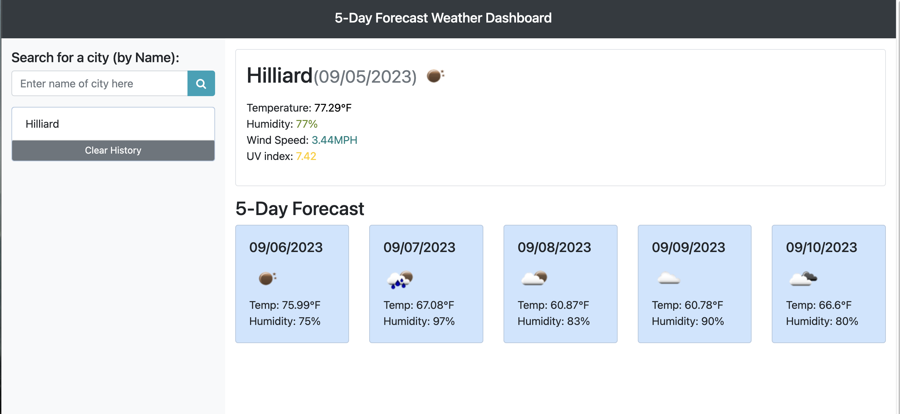

# weather-dashboard

## Technologies


## Description
5 day weather dashboard using html, css, javascript, jquery, and weather api

## Installation

1. Clone the repository at the gitHub in the link section below
2. Register for api key at (https://openweathermap.org/) and replace with your own
3. Install dependencies ```npm i```
4. Deploy to URL

## User Story
```
AS A traveler
I WANT to see the weather outlook for multiple cities
SO THAT I can plan a trip accordingly
```

## Acceptance Criteria
```
GIVEN a weather dashboard with form inputs
WHEN I search for a city
THEN I am presented with current and future conditions for that city and that city is added to the search history
WHEN I view current weather conditions for that city
THEN I am presented with the city name, the date, an icon representation of weather conditions, the temperature, the humidity, and the the wind speed
WHEN I view future weather conditions for that city
THEN I am presented with a 5-day forecast that displays the date, an icon representation of weather conditions, the temperature, the wind speed, and the humidity
WHEN I click on a city in the search history
THEN I am again presented with current and future conditions for that city
```

## Screenshot



## Link to Live Site
A link to the [Live Site](https://betheng.github.io/weather-dashboard/):
```
https://betheng.github.io/weather-dashboard/
```

## Link to GitHub
A link to the [Code](https://github.com/betheng/weather-dashboard):
```
https://github.com/betheng/weather-dashboard
```

## License
  
  Licensed under the [MIT](LICENSE) license.

## Contact
Creators GitHub link [code](https://github.com/betheng ):
```
https://github.com/betheng 
```